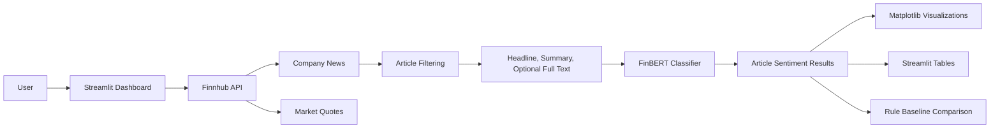
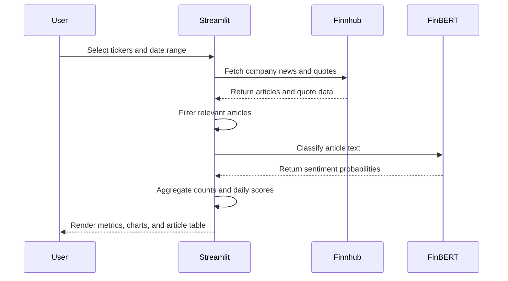

# Financial News Sentiment Analyzer

A Streamlit dashboard that analyzes market sentiment for major stocks using financial news and a pre-trained FinBERT model. The app pulls recent company news and market quotes from Finnhub, classifies each article as positive, negative, neutral, or uncertain, and visualizes ticker-level sentiment dynamics over time.

## Features

- Multi-ticker sentiment analysis for major stocks and custom symbols
- Real-time Finnhub company news ingestion
- Real-time market quote snapshots for selected tickers
- FinBERT sentiment classification with confidence scores
- Daily sentiment trend visualization by ticker
- Sentiment distribution chart and summary metrics
- Article-level results with source, timestamp, confidence, and links
- Simple rule-based baseline for model comparison
- Fine-tuning-ready structure through a configurable Hugging Face model name

## Architecture



## Sentiment Pipeline



## Project Structure

```text
FinNewsSentiment/
├── app.py              # Streamlit dashboard and visualization layer
├── newsPull.py         # Finnhub helpers, FinBERT inference, aggregation utilities
├── requirements.txt    # Python dependencies
├── README.md           # Project documentation
└── .gitignore          # Local files, secrets, cache, and environment ignores
```

## Setup

1. Clone the repository and enter the project directory.

```bash
git clone <repo-url>
cd FinNewsSentiment
```

2. Create and activate a virtual environment.

```bash
python3 -m venv venv
source venv/bin/activate
```

3. Install dependencies.

```bash
pip install -r requirements.txt
```

4. Configure a Finnhub API key.

Option A: environment variable

```bash
export FINNHUB_API_KEY="your_finnhub_api_key"
```

Option B: Streamlit secrets

```toml
# .streamlit/secrets.toml
[FINNHUB]
API_KEY = "your_finnhub_api_key"
```

5. Run the app.

```bash
streamlit run app.py
```

## Usage

1. Select one or more default tickers in the sidebar.
2. Add any custom tickers as comma-separated symbols.
3. Choose a date range.
4. Choose the article limit per ticker.
5. Optionally enable full article extraction for richer context.
6. Click `Run sentiment analysis`.

The dashboard shows market snapshots first, then sentiment metrics, distribution, daily sentiment dynamics, article-level classifications, and a baseline comparison tab.

## Model Details

The current implementation uses the Hugging Face model:

```text
yiyanghkust/finbert-tone
```

The app loads the model lazily and reads label names from the model configuration instead of assuming a fixed output order. Long article text is chunked before inference, and chunk probabilities are averaged into one article-level classification.

The sentiment score is calculated as:

```text
(positive_article_count - negative_article_count) / total_articles
```

Scores range from `-1.0` to `+1.0`.

## Model Comparison and Fine-Tuning Roadmap

Implemented today:

- FinBERT inference
- A transparent keyword baseline for comparison
- Agreement rate between the baseline and FinBERT

Planned extensions:

- Add labeled financial news datasets
- Fine-tune FinBERT on domain-specific article labels
- Compare FinBERT against other transformer checkpoints
- Track precision, recall, F1, and confusion matrices
- Save experiment results for repeatable evaluation

To use a fine-tuned checkpoint later, update `MODEL_NAME` in `newsPull.py` to point to a local or hosted Hugging Face model.

## Security Notes

Do not commit `.streamlit/secrets.toml` or saved variants of that file. The repository ignores Streamlit secret files by default, but any exposed API key should still be rotated.

## Limitations

- Finnhub news availability depends on ticker, date range, and API plan.
- Full article extraction can fail when publishers block scraping.
- The rule-based baseline is intentionally simple and should not be treated as a production model.
- Sentiment is news-based and should not be interpreted as investment advice.
